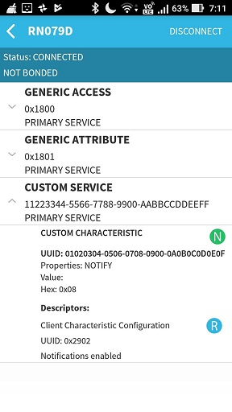
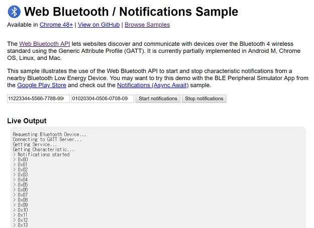

# BLE

## DIP board of Microchip RN4020

Microchip [RN4020](https://www.microchip.com/wwwproducts/en/RN4020) module is very easy-to-use. I use [this DIP board](http://akizukidenshi.com/catalog/g/gK-11102/).

## Creating an original service "Edge AI inference"

### On a terminal software

Config
```
+
SF,1
SS,00000001
SR,20000000
PZ
PS,11223344556677889900AABBCCDDEEFF
PC,010203040506070809000A0B0C0D0E0F,10,16
PC,010203040506070809000A0B0C0DEEFF,04,16
R,1
```

When I connected and disconnected BLE Scanner to RN4020, the console outputed the following:
```
Connected
ConnParam:0006,0000,07D0
ConnParam:0027,0000,07D0
WV,000E,01020304.
WC,000C,0100.
Connection End
```

When I entered a command to send a notification, the console outputed the following:
```
(SUW,010203040506070809000A0B0C0D0E0F,03)
AOK
AOK
```

## On BLE scanner (Android app)

I use Android app [BLE Scanner](https://play.google.com/store/apps/details?id=com.macdom.ble.blescanner&hl=en) in this test.

"Hex: 0x08" means the class label is 8.




## Gateway code

==> **[gateway.py](./BLE/python/gateway.py)**

## Web Bluetooth

### On Web Bluetooth (HTML5)

I run the python script on my PC, and I also run ["Web Bluetooth / Notification" sample](https://googlechrome.github.io/samples/web-bluetooth/notifications.html) on Chrome browser on my PC. It works!

```
Service UUID: 11223344-5566-7788-9900-aabbccddeeff
Characteristic UUID: 01020304-0506-0708-0900-0a0b0c0d0e0f
```



### A simpler version of SPA based on Web Bluetooth

A simpler version of "Web Bluetooth / Notification" sample is [here](./html5/notifications.html). Thanks to Vue.js, the html5 code is very simple.

## References

- [RN4020 user's guide](http://ww1.microchip.com/downloads/en/devicedoc/70005191b.pdf)
- [Web Bluetooth](https://developers.google.com/web/updates/2015/07/interact-with-ble-devices-on-the-web)
